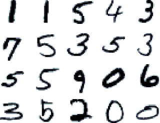

% Neural Networks in action
% Dino Ratcliffe
% \today

# Neurons

------------------

## Artificial Neuron


------------------

## Artificial Neuron

- Single Neuron can compute logic
    - AND, NOT, OR
- Flexibility in Activation Functions
    - Step
    - Continuous Log-Sigmoid
    - Softmax
    - Rectifier
- Bias
    - Additional degree of freedom

## Artificial Neuron - TensorFlow

```python
input_data = tf.placeholder(tf.float32, [None, 2])

W = tf.Variable(tf.zeros([2, 1]))
b = tf.Variable(tf.zeros([1]))

output = tf.nn.sigmoid(tf.matmul(input_data, W) + b)
```

# Networks

## Feed Forward

{ width=200px }

------------------

## Feed Forward - TensorFlow

```python
input_data = tf.placeholder(tf.float32, [None, 3])

W_l1 = tf.Variable(tf.zeros([3, 4]))
b_l1 = tf.Variable(tf.zeros([4]))

h_l1 = tf.nn.sigmoid(tf.matmul(input_data, W_l1) + b_l1)

W_l2 = tf.Variable(tf.zeros([4, 3]))
b_l2 = tf.Variable(tf.zeros([3]))

h_l2 = tf.nn.sigmoid(tf.matmul(h_l1, W_l2) + b_l2)
...
```

## Back Propagation - Gradient Decent

- Uses partial derivatives to obtain a 
  gradient for the weights and biases 
- Take small steps along the gradient to
  minimize the error

## Back Propagation - TensorFlow

```python
optimizer = tf.train.GradientDescentOptimizer(0.001)
train_step = optimizer.minimize(error)
```

# MNIST Demo

## MNIST (Mixed National Institute of Standards and Technology)

- Handwritten digit dataset
- 28x28 images
- 60,000 training images
- 10,000 test images

{ width=100px }

------------------

DEMO

# Convolution

## Convolution

- Technique used in computer vision
- Used for many image filtering tasks 
    - Blurring
    - Sharpening
    - Embossing
    - Edge Detection

## Convolution

{ width=200px }

## Convolution - TensorFlow

```python
W_conv = tf.Variable(tf.truncated_normal([3, 3, 1, 32], 
                                         stddev=0.1))
b_conv = tf.Variable(tf.constant(0.1, shape=[32]))

convolution = tf.nn.conv2d(input_data, W_conv, 
                           strides=[1, 1, 1, 1])

h_conv = tf.nn.relu(convolution + b_conv)
```

## Convolution Fully Conected

```python
W_fc = tf.Variable(tf.truncated_normal([w * h * 32, 1024], 
                                         stddev=0.1))
b_fc = tf.Variable(tf.constant(0.1, shape=[1024]))

h_conv_flat = tf.reshape(h_conv, [w * h * 32])

h_fc = tf.nn.relu(tf.matmul(h_conv_flat, W_fc) + b_fc1)
```

# Tricks

## Max Pooling

```python
h_pool = tf.nn.max_pool(h_conv, ksize=[1, 2, 2, 1],
                                strides=[1, 2, 2, 1])
```

## Dropout

```python
keep_prob = tf.placeholder(tf.float32)
h_fc1_drop = tf.nn.dropout(h_fc1, keep_prob)
```

## Saving Models

```python
saver = tf.train.Saver()
sess = tf.Session()
sess.run(tf.initialize_all_variables())

# training

saver.save(sess, 'dir/to/save/model.ckpt', t_step)
```

## Loading Models

```python
ckpt = tf.train.get_checkpoint_state('dir/to/save')

if ckpt and ckpt.model_checkpoint_path:
    saver.restore(sess, ckpt.model_checkpoint_path)
    print 'loaded model at: dir/to/save'
else:
    print 'No model found at: dir/to/save'
```

## Logging/Graphing

```python
score = tf.placeholder(tf.float32)
tf.scalar_summary("score", score)

v = tf.placeholder(tf.float32)
tf.scalar_summary("v", v)

summary_op = tf.merge_all_summaries()
summary_writer = tf.train.SummaryWriter('dir/to/logs', 
                                        sess.graph_def)

summary_str = sess.run(summary_op, feed_dict = {
    score: 10.2,
    v: 0.2})

summary_writer.add_summary(summary_str, t_step)
```

# DQN

## Deep Q Networks

- Combines reinforcement learning and neural networks
- Input: game state
- Output: action-values

------------------


------------------

## Target Ouput

$$T = R + \gamma\max\theta(S_{t+1})$$

## Error 
$$E = \frac{1}{N}\sum_{i=1}^N(T - V_{a})^2$$

```python
action_value = tf.reduce_sum(tf.mul(output, action), 
                             reduction_indices = 1)
error = tf.reduce_mean(tf.square(target - action_value))
```

## Experiences

- $S{_t}$:      initial state
- $a$:       action taken from the initial state
- $R$:       reward recieved after taking action $a$
- $S_{t+1}$:    resulting state after taking action $a$
- $t$:       is initial state terminal

## Experience Replay

- Store queue of experiences 
- Train on a sample of experiences from buffer at each time step
- Breaks up the smoothness of the environment aiding convergence

## Choosing Actions

- Pick actions greedily 
- During training explore with $\epsilon$ 
- $\epsilon$ is the probability of picking a random action
